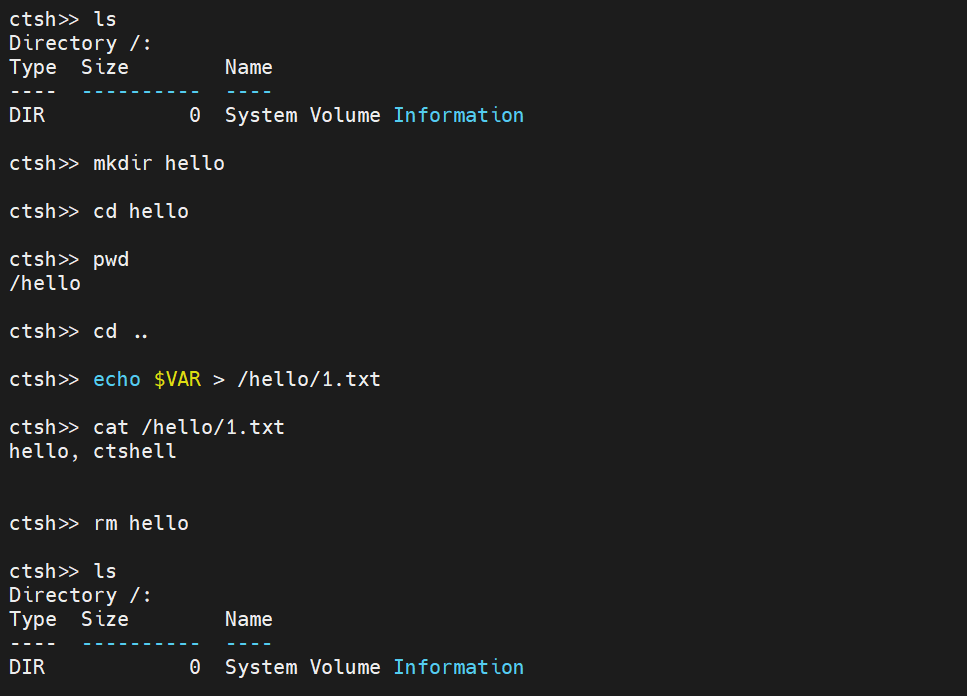
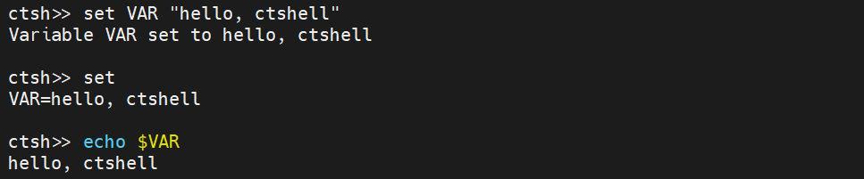

# ctshell

 

Ctshell is a low-overhead shell designed specifically for resource-constrained embedded systems.

## Highlights

* Tab Completion: Supports auto-completion for commands using the TAB key.
* Command History: Supports cycling through history entries using Up (↑) and Down (↓) arrow keys.
* Line Editing: Supports cursor movement (Left/Right), Backspace handling, and inserting text anywhere in the line.
* Environment Variables: Supports setting, unsetting, listing variables, and expanding them inline using the `$` prefix.
* Non-blocking Architecture: Decoupled input and processing, making it compatible with both bare-metal and RTOS environments.
* Signal Handling (SIGINT): Implements setjmp/longjmp logic to abort long-running commands via `Ctrl+C`.
* Built-in Argument Parser: Includes a strictly-typed argument parser to easily handle flags (bool), integers, strings, and verbs within custom commands.
* ANSI Escape Sequence Support: Handles standard VT100/ANSI escape codes for arrow keys and screen control.
* Filesystem Support: Out-of-box for `FatFS` now, other fs native support will come soon.
* Command Hierarchy Framework: Supports hierarchical command management.

## Porting

Ctshell is easy to port — native port implementations for multiple mainstream embedded platforms are provided out of the box.

For other details, please refer to the [docs](https://ctshell.readthedocs.io/en/latest/quickstart/porting.html).

## Basic Usage

Ctshell provides an intuitive interactive experience, and the core function demonstrations are as follows:

### View All Available Commands

Use the `help` command to quickly list all available commands and their brief descriptions.

### Filesystem Support

Use `ls`, `cd`, `pwd`, `cat`, `mkdir`, `rm`, `touch` commands to access your filesystem from ctshell.

### Embedded System Debugging

Integrate ctshell into your embedded project to quickly debug peripheral/module status.

### Environment Variable Operation

Flexibly manage environment variables with `set`/`unset` commands, and expand variables with `$` prefix.

### Abort Long-running Commands

Use `Ctrl+C` (SIGINT) to immediately terminate dead loops/long-running commands without crashing the system.

## Documentation

Available at [ctshell Documentation](https://ctshell.readthedocs.io/en/latest/).

## License

Copyright 2026 MDLZCOOL.

Distributed under the terms of the  [Apache 2.0 license](https://github.com/MDLZCOOL/ctshell/blob/main/LICENSE).